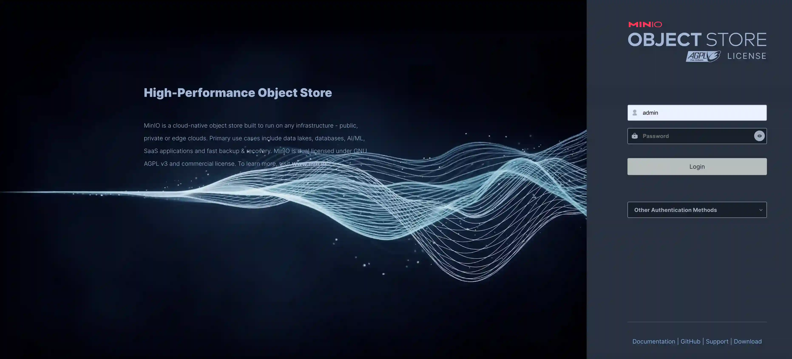
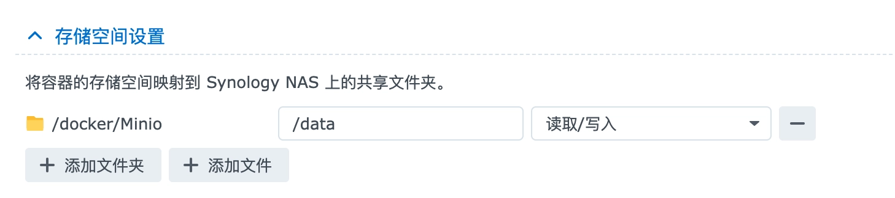

## 演示图



以下是关于使用 Docker 安装 Minio 的详细文档，群晖用户可直接使用Docker命令快速创建，Linux用户只需要改一下映射的本地data目录即可。

## 前提条件

在开始安装 Minio 之前，确保你的系统已经安装了 Docker。如果尚未安装，可以根据你的操作系统类型（如 Ubuntu、CentOS、MacOS 等），在 Docker 官方网站（https://docs.docker.com/engine/install/） 
找到相应的安装指南进行安装。

## 拉取 Minio 镜像

Minio 是一个高性能的对象存储服务，类似于亚马逊的 S3。打开终端（在 Windows 上是命令提示符或 PowerShell），运行以下命令从 Docker Hub 拉取 Minio 官方镜像：

```
docker pull minio/minio
```

这个命令会从 Docker Hub 下载 Minio 的最新版本镜像。下载时间取决于你的网络速度和镜像大小。

## 创建并运行 Minio 容器

也可以执行以下命令来直接拉取镜像创建并运行一个 Minio 容器：

```
docker run \
-p 9000:9000 \
-p 9090:9090 \
--name minio \
-v /volume1/docker/Minio:/data \
-e "MINIO_ROOT_USER=admin" \
-e "MINIO_ROOT_PASSWORD=密码不少于八位数" \
minio/minio server /data --console-address ":9090"
```

下面对这个命令中的参数进行详细解释：

1. `-p 9000:9000 -p 9090:9090`：
   - 这是端口映射部分。将主机（你的本地机器或服务器）的 9000 端口映射到容器内的 9000 端口，用于 Minio 的 API 访问；将主机的 9090 端口映射到容器内的 9090 端口，用于 Minio 的控制台访问。
2. `--name minio`：
   - 为容器指定一个名称，这里命名为“minio”，方便后续对容器进行管理。
3. `-v /volume1/docker/Minio:/data`：
   - 这是数据卷挂载部分。将主机上的`/volume1/docker/Minio`目录挂载到容器内的`/data`目录。这样做的好处是实现数据持久化，即使容器被删除或重新创建，存储在这个目录中的数据也不会丢失。
4. `-e "MINIO_ROOT_USER=admin"`和`-e "MINIO_ROOT_PASSWORD=密码不少于八位数"`：
   - 这是环境变量设置部分。设置 Minio 的访问密钥为“admin”（你可以根据实际需求进行修改），并设置一个不少于八位数的密码用于访问和管理 Minio 存储。
5. `minio/minio server /data --console-address ":9090"`：
   - 这是容器运行时执行的命令。`minio/minio`是镜像名称，`server /data`表示在容器内启动 Minio 服务器，并将数据存储在`/data`目录下（在容器内部）。`--console-address ":9090"`指定 Minio 控制台的访问地址为容器内的 9090 端口。
   - 
## 映射目录示例



## 访问 Minio 控制台**

打开浏览器，访问`http://localhost:9090`（如果是在本地机器上运行）。你会看到 Minio 的登录界面。使用之前设置的访问密钥（这里是“admin”）和密码进行登录。

登录成功后，你可以在控制台中创建存储桶（buckets）、上传和下载文件等操作，就像使用其他云存储服务一样。

通过以上步骤，你就成功地使用 Docker 安装了 Minio，并可以开始使用它来存储和管理你的数据。