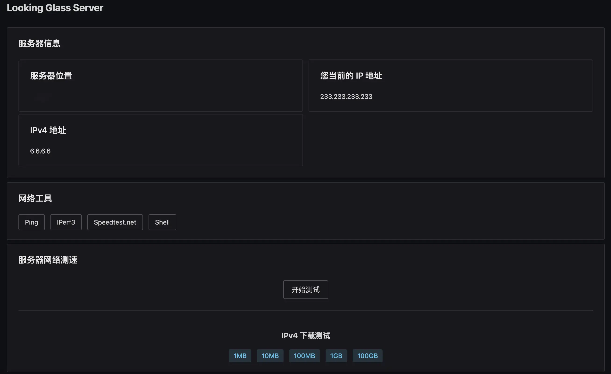

## 演示图




## 自定义端口

-e HTTP_PORT=2333 \

2333修改成你想要设置的端口

运行命令即可

## 拉取镜像
```bash
docker pull wikihostinc/looking-glass-server
```

## 运行命令

```bash
docker run -d \
    --name looking-glass \
    -e HTTP_PORT=2333 \
    --restart always \
    --network host \
    wikihostinc/looking-glass-server
```