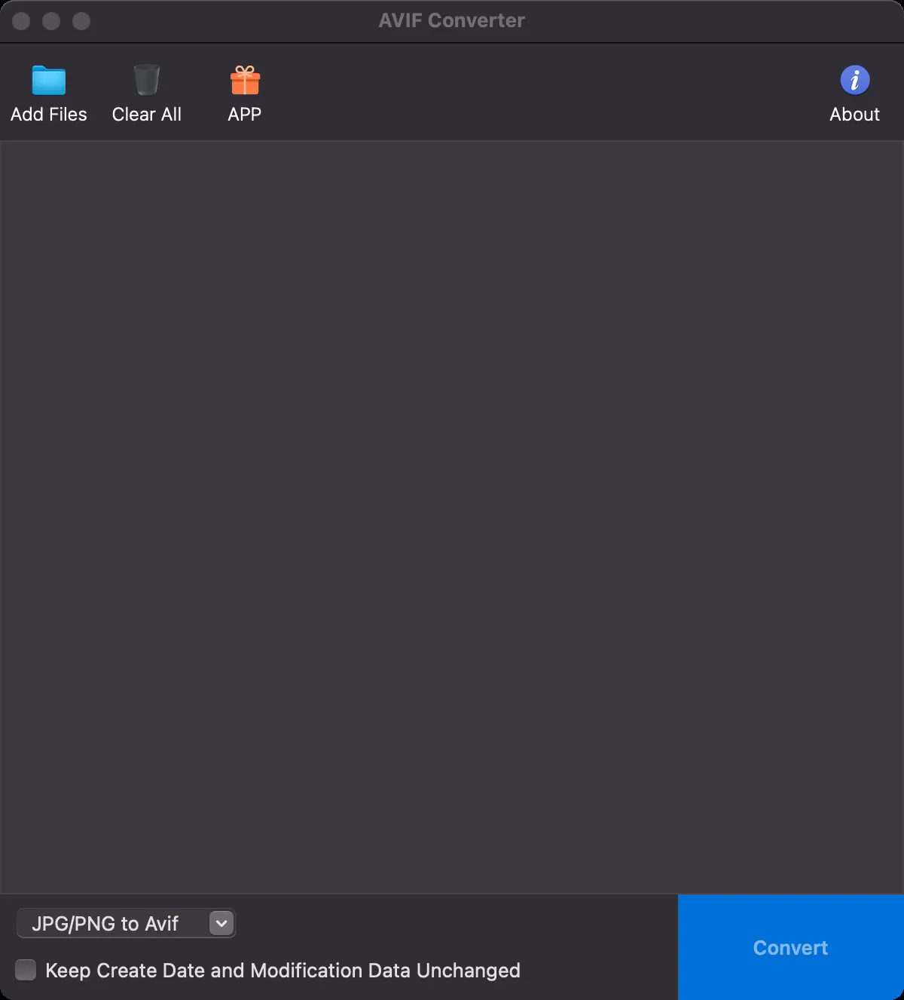

我在用的avif转换工具 Appstore里直接就可以搜到下载 也可以去官网使用网页版 

遗憾的是只能jpg跟png转avif webp不行。。 转换力度也无法自定义

## 转换力度

就拿软件截图来说吧 微信直接截图 png格式 79kb 用这个软件转换成了 avif格式 直接变15kb 

我反正看不出啥差别 丢进文档挺合适 但是这个文档系统生成构建显示avif都没问题

但就是要报错 而且还关不掉 挺烦的。。。所以我还是换回webp了

## 软件截图

## 官方网站

https://avif2jpg.net/zh

## 软件下载

https://apps.apple.com/us/app/avif-to-jpg-avif-converter/id1633606759?l=zh-Hans-CN&mt=12

## 常见问题
官网上写的一些常见问题
### 如何使用AVIF转JPG转换器？
要使用我们的AVIF转JPG转换器，只需上传您的AVIF文件，点击转换按钮，然后下载生成的JPG文件。过程快速且简单。

### AVIF转JPG转换器是免费的吗？
是的，我们的AVIF转JPG转换器完全免费使用。没有隐藏费用或收费。

### 我可以一次转换多个AVIF文件为JPG吗？
是的，我们的AVIF转JPG转换器支持批量处理，允许您一次将多个AVIF文件转换为JPG。

### AVIF转JPG转换器会存储我的文件吗？
不会，我们重视您的隐私和安全。我们的AVIF转JPG转换器在转换完成后不会存储您的任何文件。

### 使用AVIF转JPG转换器时，我的图像会丢失质量吗？
虽然JPG是一种有损格式，但我们的AVIF转JPG转换器旨在在转换过程中保持尽可能高的图像质量。

### AVIF转JPG转换器有文件大小限制吗？
虽然我们的AVIF转JPG转换器可以处理大多数文件大小，但非常大的文件可能会有一些限制。如果您遇到问题，请尝试减少文件大小或使用批量处理。