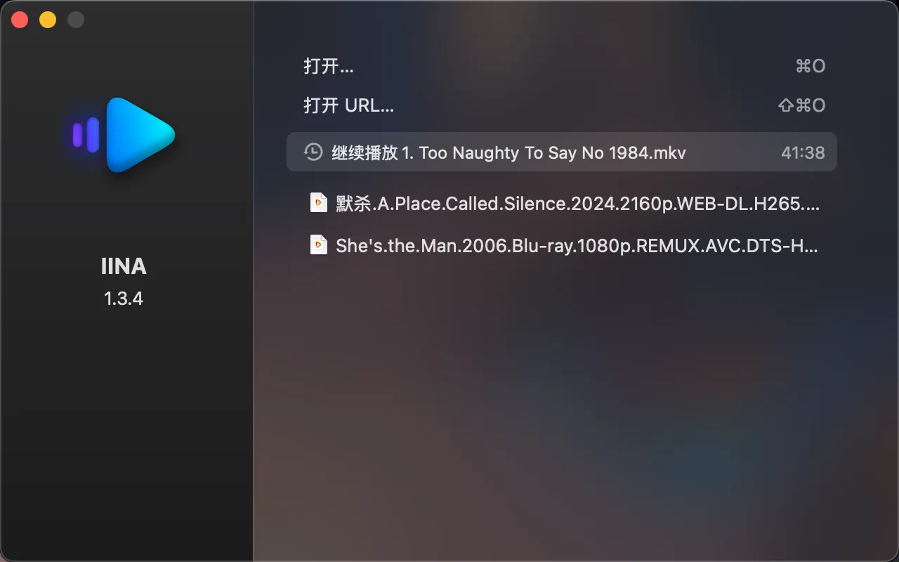

## 软件截图

## IINA 介绍
- **基本信息**：
    - **开发者**：IINA 是由一群开发者为 macOS 系统开发的免费开源视频播放器。
    - **核心技术**：基于强大的 MPV（一个命令行启动/高度可定制的跨平台高性能开源播放器），使用 Swift 语言进行开发。
    - **设计理念**：其目标是打造一款符合现代 macOS 设计风格的视频播放器，力求做到轻便且功能强大，提供最佳的用户体验。
- **功能特性**：
    - **格式支持广泛**：几乎支持所有常见的视频格式和编码，如 MP4、MKV、AVI、H.264、HEVC、VP9 等，无论是本地硬盘中的视频文件，还是网络流媒体视频，都能轻松播放。
    - **字幕功能强大**：支持外部字幕文件，并且可以使用 Shift + Command + D 快捷键自动下载网络字幕。用户还可以对字幕的字体、大小、颜色、位置等进行自定义设置。
    - **播放列表管理**：方便用户创建和管理自己的播放列表，支持按顺序播放、循环播放、随机播放等多种播放模式。
    - **高级播放控制**：提供了丰富的播放控制选项，如播放速度调节（可自定义播放速度倍数）、跳过片头片尾、画面截图、音频增益调节等。
    - **界面定制性高**：具有多个颜色方案和屏幕控制器（OSC）布局定位可供选择，用户可以根据自己的喜好调整播放器的界面外观和操作布局。
    - **硬件支持良好**：支持 Touch Bar、Force Touch 等苹果电脑的新硬件功能，方便用户通过触摸操作来控制视频播放。
    - **历史记录与书签**：拥有无限的播放历史记录功能，方便用户快速找到之前播放过的视频。同时，用户还可以设置书签，标记视频中的特定位置，以便下次快速跳转。
    - **在线播放支持**：在 youtube-dl 和浏览器扩展的支持下，可以一键播放各种在线流视频。
    - **视频滤镜与音频均衡器**：提供了视频滤镜和音频均衡器等高级功能，用户可以根据自己的需求对视频的画面和音频效果进行调整和优化。
- **优势与适用场景**：
    - **优势方面**：与其他 macOS 上的视频播放器相比，IINA 在功能、性能和用户体验上都具有显著优势。它的界面简洁美观，操作方便快捷，同时拥有强大的视频解码能力和丰富的功能选项，能够满足不同用户的需求。
    - **适用场景**：适用于各种场景，如日常观影、教学培训、视频编辑等。对于普通用户来说，IINA 是一款优秀的视频播放器，可以提供高质量的视听体验；对于开发者和视频编辑人员来说，IINA 的高级功能和可定制性使其成为一个实用的工具。

## 下载地址

- **官方渠道**：可以访问 IINA 的官方网站（[iina.io](https://iina.io/)）获取最新版本的下载链接。
- **第三方软件下载平台**：一些知名的软件下载平台，如[MacW](https://www.macw.com/mac/573.html?id=ode0mjcmxyyzni4xmzqunjkumtm%3d)、[系统之家](https://m.xitongzhijia.net/soft/193768.html)等也可能提供 IINA 的下载，但为了确保软件的安全性和完整性，建议优先从官方渠道下载。

## 使用教程

- **基本播放**：
    - **打开视频文件**：启动 IINA 后，点击“打开”按钮，会弹出一个对话框，找到你想播放的视频文件所在的目录，双击视频文件，然后点击“确定”即可开始播放。你也可以直接将视频文件拖放到 IINA 应用图标上进行播放。
    - **播放控制**：在播放过程中，可以使用播放界面下方的控制栏进行暂停/播放、快进/快退、调节音量等操作。还可以通过菜单栏中的“播放”选项进行更多的播放控制操作，如设置播放速度、跳过片头片尾等。
- **创建播放列表**：
    - **添加视频到播放列表**：在正在观看的视频的界面中，找到列表按钮（通常位于播放界面的某个角落），点击一下开始创建播放列表。然后点击右下角的“+”号，弹出对话框，找到你想添加的视频资源，点击“打开”按钮，视频就会出现在播放列表中。
    - **管理播放列表**：可以对播放列表中的视频进行排序、删除等操作。在播放列表界面中，长按某个视频文件，会弹出相应的操作选项。
- **设置与个性化**：
    - **界面设置**：点击菜单栏中的“IINA”->“偏好设置”，可以打开设置界面。在这里可以调整界面的颜色方案、OSC 布局定位、字幕显示样式等。
    - **快捷键设置**：同样在偏好设置中，切换到“快捷键”选项卡，可以查看和修改各种操作的快捷键。你也可以根据自己的习惯自定义快捷键，点击“+”号新增快捷键定义，然后按照提示进行操作。
    - **视频滤镜和音频均衡器设置**：在播放视频时，点击菜单栏中的“视频”和“音频”选项，可以打开视频滤镜和音频均衡器的设置界面，根据自己的需求进行调整。