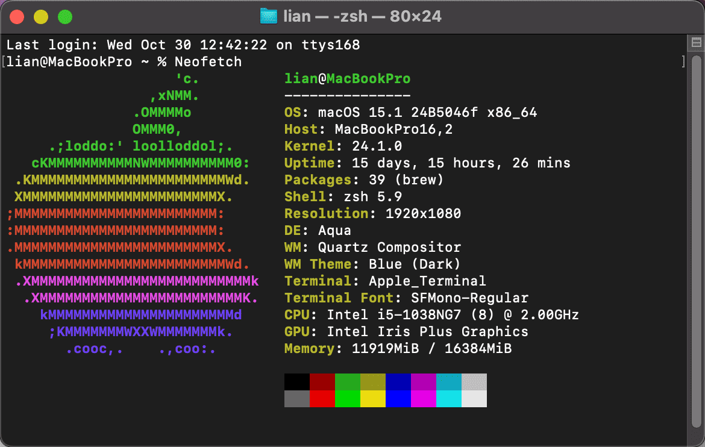

`Neofetch` 是一个用来在终端中显示系统信息的工具，通常用于展示系统的概览，包括操作系统、内核版本、CPU、内存、安装时间等信息。它的输出通常伴随着一个 ASCII 艺术图形，代表你的操作系统或其他自定义图形。以下是 `Neofetch` 在 macOS 下的详细玩法：

### 安装 Neofetch

如果你还没有安装 `Neofetch`，可以使用 Homebrew 安装：

```bash
brew install neofetch
```

### 基本用法

安装完成后，你可以在终端中运行：

```bash
neofetch
```

这将显示系统信息和 ASCII 艺术图形。

### 自定义 Neofetch

`Neofetch` 提供了多种自定义选项，可以通过修改配置文件来改变输出内容和样式。

#### 配置文件

配置文件通常位于 `~/.config/neofetch/config.conf`。如果该文件不存在，可以通过运行以下命令生成默认配置文件：

```bash
neofetch --config none
```

你可以使用任何文本编辑器打开并编辑该文件，例如：

```bash
nano ~/.config/neofetch/config.conf
```

#### 修改输出内容

在配置文件中，你可以设置哪些信息要显示或隐藏。以下是一些常见的设置：

- **改变 ASCII 艺术**：可以选择不同的 ASCII 图形，修改 `ascii_distro` 变量。
- **自定义颜色**：可以通过修改 `color` 变量来改变输出文本的颜色。
- **显示隐藏信息**：可以选择显示或隐藏某些信息，如 GPU、Shell、桌面环境等。

### 其他命令行选项

`Neofetch` 还有一些命令行选项可以直接使用：


- **显示帮助信息**：
  ```bash
  neofetch --help
  ```

### 示例输出





### 总结

`Neofetch` 是一个非常灵活且易于使用的工具，可以帮助你快速查看系统信息并自定义输出。通过修改配置文件和使用命令行选项，你可以根据自己的需求来调整显示内容。