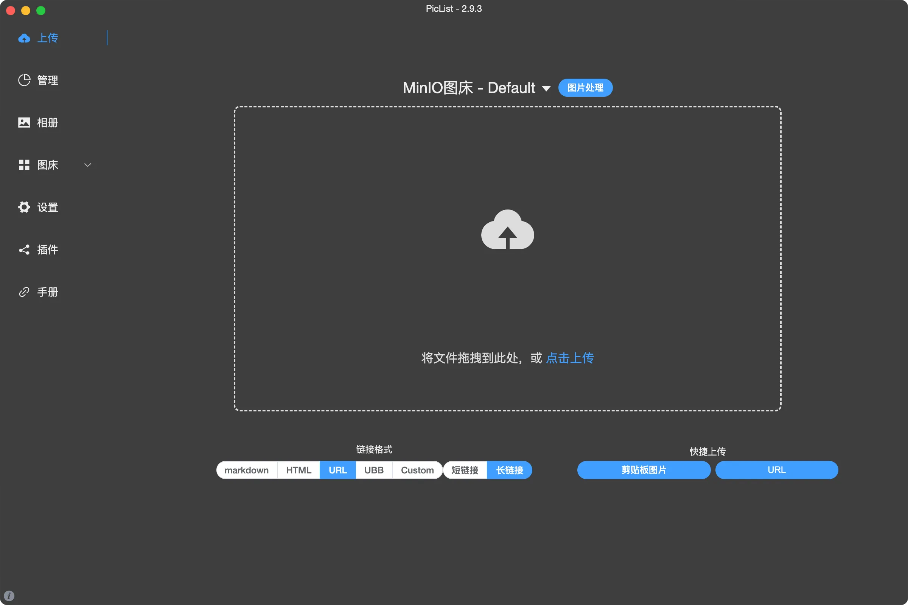

## 软件截图


PicList是一款高效的云存储和图床平台管理工具，在PicGo的基础上经过深度的二次开发，不仅完整保留了PicGo的所有功能，还增添了许多新的feature。例如相册支持同步云端删除文件，内置图床额外添加了WebDav、本地图床和SFTP等。

PicList同时增加了完整的云存储管理功能，包括云端目录查看、文件搜索、批量上传下载和删除文件，复制多种格式文件链接和图片/markdown/文本/视频预览等，另外还有更加强大的相册和多项功能新增或优化。

## Piclist 安装
在 macOS 上安装 PicList，可以按照以下步骤进行：

1. **安装 Homebrew**（如果尚未安装）：
   Homebrew 是 macOS 的包管理器，可以方便地安装软件。在终端中运行以下命令以安装 Homebrew：
   ```bash
   /bin/bash -c "$(curl -fsSL https://raw.githubusercontent.com/Homebrew/install/HEAD/install.sh)"
   ```

2. **安装 PicList**：
   一旦 Homebrew 安装完成，可以使用以下命令安装 PicList：
   ```bash
   brew install piclist
   ```

3. **验证安装**：
   安装完成后，可以进入启动台，看Piclist是否安装成功。
