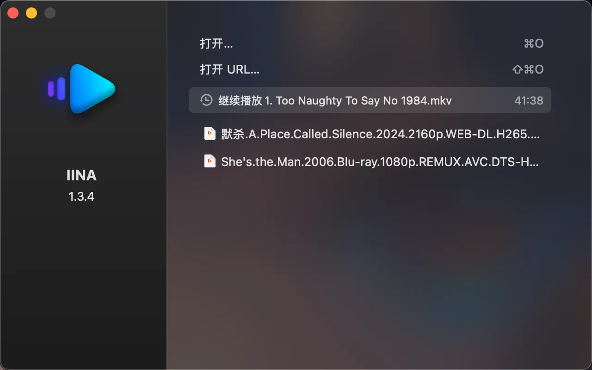

## Software Screenshots

## Introduction to IINA
- **Basic Information**:
    - **Developers**: IINA is a free and open-source video player developed by a group of developers for the macOS system.
    - **Core Technology**: It is based on the powerful MPV (a command-line launched/highly customizable cross-platform high-performance open-source player) and is developed using the Swift language.
    - **Design Philosophy**: Its goal is to create a video player that conforms to the modern macOS design style, aiming to be lightweight yet powerful, providing the best user experience.
- **Functional Features**:
    - **Wide Format Support**: It supports almost all common video formats and encodings, such as MP4, MKV, AVI, H.264, HEVC, VP9, etc. Whether it's a video file on the local hard drive or a network streaming video, it can be played easily.
    - **Powerful Subtitle Function**: It supports external subtitle files and can automatically download network subtitles using the Shift + Command + D shortcut. Users can also customize the font, size, color, and position of the subtitles.
    - **Playlist Management**: It allows users to easily create and manage their own playlists, supporting multiple playback modes such as sequential playback, loop playback, and random playback.
    - **Advanced Playback Control**: It provides a wealth of playback control options, such as playback speed adjustment (customizable playback speed multiplier), skipping intros and outros, taking screenshots of the screen, and adjusting audio gain.
    - **Highly Customizable Interface**: It has multiple color schemes and On-Screen Controller (OSC) layout positions to choose from, allowing users to adjust the appearance and operation layout of the player according to their preferences.
    - **Good Hardware Support**: It supports new hardware features of Apple computers such as Touch Bar and Force Touch, enabling users to control video playback through touch operations.
    - **History and Bookmarks**: It has an unlimited playback history function, making it convenient for users to quickly find previously played videos. At the same time, users can also set bookmarks to mark specific positions in the video for quick jumps next time.
    - **Online Playback Support**: With the support of youtube-dl and browser extensions, it can play various online streaming videos with one click.
    - **Video Filters and Audio Equalizer**: It provides advanced functions such as video filters and audio equalizer, allowing users to adjust and optimize the visual and audio effects of the video according to their needs.
- **Advantages and Applicable Scenarios**:
    - **Advantages**: Compared with other video players on macOS, IINA has significant advantages in terms of functionality, performance, and user experience. Its interface is simple and beautiful, the operation is convenient and fast, and it has powerful video decoding capabilities and rich functional options, which can meet the needs of different users.
    - **Applicable Scenarios**: It is applicable to various scenarios, such as daily movie watching, teaching and training, video editing, etc. For ordinary users, IINA is an excellent video player that can provide a high-quality audiovisual experience; for developers and video editing personnel, the advanced functions and customizability of IINA make it a practical tool.

## Download Addresses

- **Official Channels**: You can visit the official website of IINA ([iina.io](https://iina.io/)) to obtain the download link of the latest version.
- **Third-Party Software Download Platforms**: Some well-known software download platforms, such as [MacW](https://www.macw.com/mac/573.html?id=ode0mjcmxyyzni4xmzqunjkumtm%3d), [System Home](https://m.xitongzhijia.net/soft/193768.html), etc., may also provide the download of IINA. However, to ensure the security and integrity of the software, it is recommended to download from the official channels first.

## Usage Tutorial

- **Basic Playback**:
    - **Opening Video Files**: After starting IINA, click the "Open" button, and a dialog box will pop up. Locate the directory where the video file you want to play is located, double-click the video file, and then click "OK" to start playing. You can also directly drag and drop the video file onto the IINA application icon to play it.
    - **Playback Control**: During the playback process, you can use the control bar below the playback interface to perform operations such as pause/play, fast forward/rewind, and volume adjustment. You can also perform more playback control operations through the "Play" option in the menu bar, such as setting the playback speed and skipping intros and outros.
- **Creating Playlists**:
    - **Adding Videos to the Playlist**: On the interface of the video you are watching, find the list button (usually located in a corner of the playback interface), click it to start creating a playlist. Then click the "+" sign in the lower right corner, a dialog box will pop up, locate the video resources you want to add, click the "Open" button, and the video will appear in the playlist.
    - **Managing Playlists**: You can sort, delete, etc. the videos in the playlist. On the playlist interface, long-press a video file, and the corresponding operation options will pop up.
- **Settings and Personalization**:
    - **Interface Settings**: Click "IINA" -> "Preferences" in the menu bar to open the settings interface. Here, you can adjust the color scheme of the interface, the OSC layout position, and the subtitle display style.
    - **Shortcut Key Settings**: Also in the preferences, switch to the "Shortcut Keys" tab to view and modify the shortcut keys for various operations. You can also customize the shortcut keys according to your own habits. Click the "+" sign to add a new shortcut key definition, and then follow the instructions to operate.
    - **Video Filters and Audio Equalizer Settings**: When playing a video, click the "Video" and "Audio" options in the menu bar to open the settings interfaces of the video filters and audio equalizer, and adjust them according to your needs.