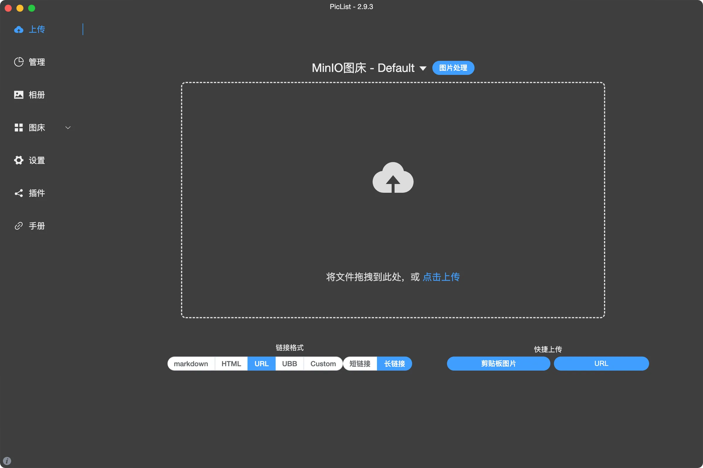

## Software Screenshots


PicList is an efficient cloud storage and image hosting platform management tool. Based on PicGo, it has undergone in-depth secondary development. It not only fully retains all the functions of PicGo but also adds many new features. For example, the album supports synchronizing cloud deletion of files, and the built-in image hosting has additional options such as WebDav, local image hosting, and SFTP.

PicList also adds comprehensive cloud storage management functions, including viewing cloud directories, searching for files, batch uploading and downloading and deleting files, copying links of various format files, and previewing images/markdown/text/videos. Additionally, there are more powerful album functions and many new or optimized features.

## Piclist Installation
To install PicList on macOS, you can follow these steps:

1. **Install Homebrew (if not already installed)**:
Homebrew is a package manager for macOS that allows for easy software installation. Run the following command in the terminal to install Homebrew:
```bash
/bin/bash -c "$(curl -fsSL https://raw.githubusercontent.com/Homebrew/install/HEAD/install.sh)"
```

2. **Install PicList**:
Once Homebrew is installed, you can use the following command to install PicList:
```bash
brew install piclist
```

3. **Verify the Installation**:
After the installation is complete, you can go to the Launchpad to check if Piclist has been installed successfully.